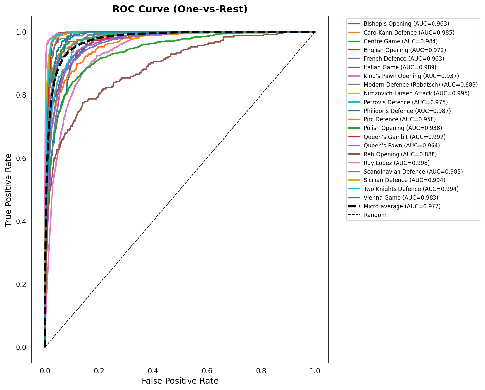
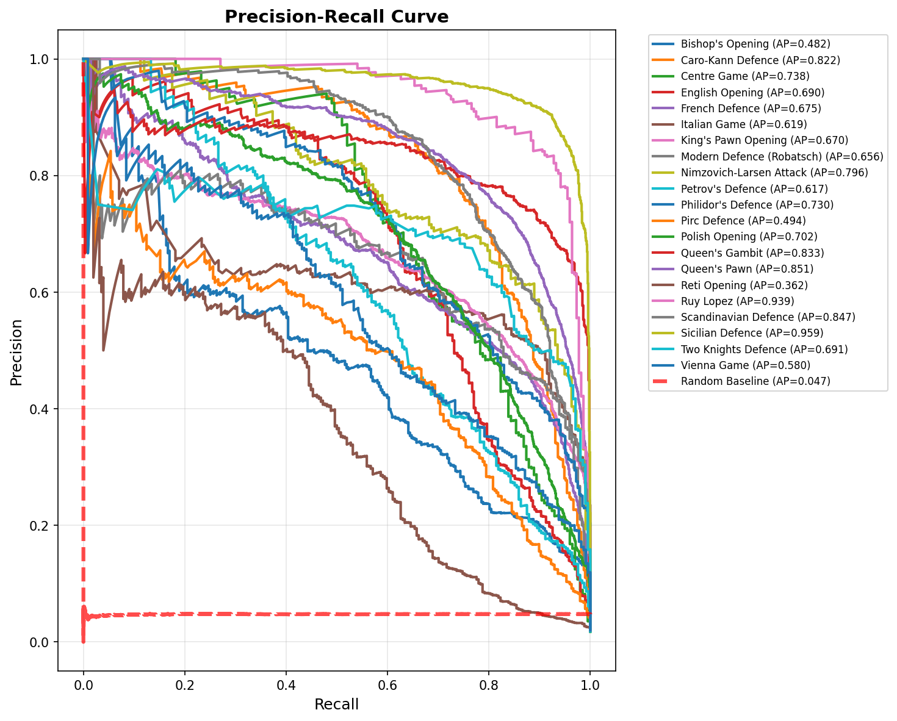
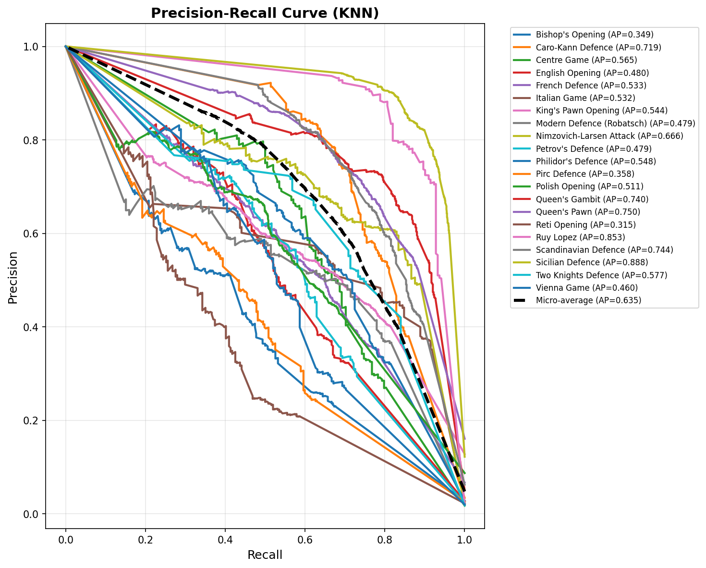
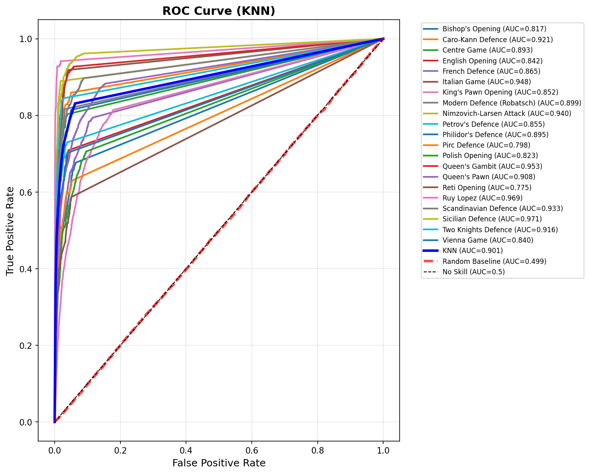

## Feature Engineering
We are building an opening classifier based on what the board looks like after 10 full moves (a full move is when both sides move). To do this we had to use the pgn column that was in our dataset and build the board for each move that a player made and after 10 full moves, record the resulting FEN (which is a string used to record what the board looks like after a certain move). We did this because the FEN column that existed in the original dataset was just the FEN after the game ended which is not what we wanted. Then with the FENS we built a 3d array (we represented the FEN as 12 8x8 matrices since there are 6 chess pieces but we need to represent the different sides so we get 12 and we want to show where each piece is on the 8 x 8 board).

Then to create the matrix to feed into our model, we needed a 1d array. In order to do that we had to flatten our 3d array into a 1d array of 768 dimensions. We added no other features, just the 768 columns that represented where each piece was on the board. We used random forest and knn and then plotted the PR and ROC curves. 

## Evaluation

### RF Model


```
============================================================
Top-K Metrics (Test Set):
============================================================
Precision@3: 0.9249
Recall@3: 0.9249
MAP@3: 0.8055

============================================================
Classification Report (Test Set):
============================================================
Class                          Precision    Recall       F1-Score    
------------------------------------------------------------------
Bishop's Opening               0.6183       0.2596       0.3657      
Caro-Kann Defence              0.8234       0.7033       0.7586      
Centre Game                    0.8812       0.4495       0.5953      
English Opening                0.8538       0.4725       0.6083      
French Defence                 0.6488       0.5990       0.6229      
Italian Game                   0.5824       0.7593       0.6592      
King's Pawn Opening            0.5487       0.7862       0.6463      
Modern Defence (Robatsch)      0.6407       0.6041       0.6218      
Nimzovich-Larsen Attack        0.7228       0.6728       0.6969      
Petrov's Defence               0.7752       0.4032       0.5305      
Philidor's Defence             0.6699       0.6409       0.6551      
Pirc Defence                   0.6178       0.3973       0.4836      
Polish Opening                 0.7432       0.6250       0.6790      
Queen's Gambit                 0.8059       0.7626       0.7836      
Queen's Pawn                   0.7196       0.8530       0.7806      
Reti Opening                   0.6625       0.2087       0.3174      
Ruy Lopez                      0.8527       0.8604       0.8565      
Scandinavian Defence           0.7527       0.7748       0.7636      
Sicilian Defence               0.8141       0.9657       0.8834      
Two Knights Defence            0.7516       0.5728       0.6501      
Vienna Game                    0.8085       0.3378       0.4765      
------------------------------------------------------------------
Accuracy: 0.7060
```
Looking at the ROC curve of one vs rest of each classification for random forest, we can see that each classification was better than random. Looking at the PR-AUC for one vs rest for random forest we can see that our model was better in the classification of some openings compared to others. 

This is the feature importance that we got from our random forest model
```
e4         0.004145      
e3         0.004143     
d4         0.004103     
c7         0.003928      
c4         0.003088    
e5         0.003018       
e2         0.002790       
c5         0.002728    
e7         0.002697      
d2         0.002370        
d5         0.002236 
```

From this we see that distinctive pawn moves like e4, d4, c5, e5, that mark the beginning of popular openings lines like bishops opening, Sicilian defense, queen’s gambit, queens pawn had the highest feature importance. This adds up to our expectations because these pawn states are pretty consistent up until middle game. We also noticed that the highest ranked features were based on pawn placements.

### KNN Model



```
Test Accuracy: 0.6418

============================================================
Top-K Metrics (Test Set):
============================================================
Precision@3: 0.8181
Recall@3: 0.8181
MAP@3: 0.7226

============================================================
Classification Report (Test Set):
============================================================
Class                          Precision    Recall       F1-Score    
------------------------------------------------------------------
Bishop's Opening               0.3867       0.4103       0.3981      
Caro-Kann Defence              0.6183       0.7417       0.6744      
Centre Game                    0.5633       0.6515       0.6042      
English Opening                0.6008       0.4725       0.5290      
French Defence                 0.5371       0.5560       0.5464      
Italian Game                   0.4623       0.7259       0.5648      
King's Pawn Opening            0.5690       0.5841       0.5764      
Modern Defence (Robatsch)      0.5373       0.5592       0.5480      
Nimzovich-Larsen Attack        0.6185       0.7097       0.6609      
Petrov's Defence               0.5598       0.5282       0.5436      
Philidor's Defence             0.5627       0.6254       0.5924      
Pirc Defence                   0.4875       0.3939       0.4358      
Polish Opening                 0.6823       0.4360       0.5320      
Queen's Gambit                 0.6795       0.7972       0.7337      
Queen's Pawn                   0.7405       0.6947       0.7168      
Reti Opening                   0.5177       0.2874       0.3696      
Ruy Lopez                      0.7636       0.8874       0.8208      
Scandinavian Defence           0.6767       0.7524       0.7126      
Sicilian Defence               0.8010       0.8936       0.8448      
Two Knights Defence            0.6321       0.5922       0.6115      
Vienna Game                    0.6352       0.4489       0.5260      
------------------------------------------------------------------
Macro Avg                      0.6015       0.6071       0.5972      
Weighted Avg                   0.6426       0.6418       0.6365      
Accuracy                       0.6418 
```

Our knn model did not do as well as our random forest model. Looking at the PR and ROC curve we can see that it’s clearly worse than the curves we had from random forest. However we can still see the same trends for which openings our model was able to classify better than others, for both random forest and knn classification of Sicilian Defence was one of the best while Reti Opening was the worst.


## Ideas for final report

We did a 80/20 train test split for each opening but looking at the opening that had the best pr curve we noticed that it was an opening that had the 2nd most appearances in our dataset. This could mean that the models that appeared more times in our training test were able to be better classified so one thing we might do in the future is to use the same amount of occurrences of each opening in both our train and test data.

Some ideas we have for our final report is to see if we can do any dimensionality reduction. Obviously 768 dimensions is a lot and could be limiting the performance of our classifier. We will try to see if we can use something like SVD to get a smaller matrix to feed into our model. Another thing we are looking into is possibly using other models like XG Boost to see if that could also be another source of improvement. We are also considering other features not related to where pieces are located but other signals like material advantage, isolated pawns, and double pawns.